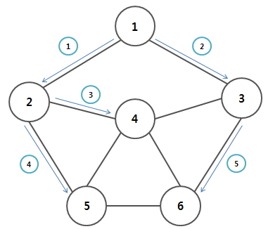
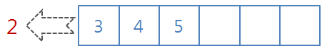
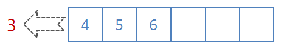

# 너비 우선 탐색(BFS)
- 너비 우선 탐색이란?
- 특징
- 과정
- 장단점
- 구현

## You Can Answer
- 너비 우선 탐색이란 무엇인가요?
- 너비 우선 탐색의 특징에 대해 설명해보세요.
- 너비 우선 탐색의 장단점에 대해 설명해보세요.
- 너비 우선 탐색은 어떻게 구현하나요?
---
## 너비 우선 탐색이란?
루트 노드(혹은 다른 임의의 노드)에서 시작해 인접한 노드를 먼저 탐색하는 방법

## 너비 우선 탐색의 특징
- 재귀적으로 동작하지 않는다.
- 두 노드 사이의 최단 경로를 탐색할 때 활용하기 좋다.
- 큐를 사용하여 탐색한다.
- FIFO 원칙으로 탐색한다.

## 너비 우선 탐색의 과정


    1. 1번 노드 방문(시작 노드)
      1-1. 1번 노드를 큐에 삽입
    2. 큐에 방문할 노드가 존재하는지 확인
    3. 존재할 경우 큐에서 노드를 뺀다.
    4. 해당 노드와 인접한 노드들을 방문했는지 확인
      4-1. 방문하지 않았으면 큐에 삽입 후 방문 표시
      4-2. 방문했으면 건너뛰기

2,3,4,5번을 큐에 노드가 없을 때까지 반복


## 예시

방문 순서는 '1->2->3->4->5->6' 임을 알 수 있다.

1. 시작 노드 1을 큐에 넣는다.

2. 2번, 3번 노드가 1번 노드와 인접하며, 큐에서 1번 노드를 빼고 2번, 3번 노드를 큐에 삽입한다.

3. 4번, 5번 노드가 2번 노드와 인접하며, 큐에서 2번 노드를 빼고 4번, 5번 노드를 큐에 삽입한다.

4. 4번, 6번 노드가 3번 노드와 인접하며, 큐에서 3번 노드를 빼고 6번 노드를 큐에 삽입한다. 4번 노드는 이미 방문했던 노드이므로 탐색할 필요가 없다.

5. 큐에서 4번 노드를 빼는데, 4번 노드와 인접한 2번, 3번, 5번, 6번 노드는 이미 방문했던 노드들이므로 탐색할 필요가 없다.

6. 큐에서 5번 노드를 빼는데, 5번 노드와 인접한 2번, 4번, 6번 노드는 이미 방문했던 노드들이므로 탐색할 필요가 없다.

7. 큐에서 6번 노드를 빼는데, 6번 노드와 인접한 3번, 4번, 5번 노드는 이미 방문했던 노드들이므로 탐색할 필요가 없다.
8. 큐에 더이상 탐색할 노드가 없으므로 탐색을 종료한다.


## 너비 우선 탐색의 장단점
- 장점
  - 노드 수가 적고 깊이가 얕은 경우 빠르게 동작할 수 있다.
  - 단순 검색 속도가 깊이 우선 탐색보다 빠르다.
  - 최단 경로가 존재한다면 어느 한 경로가 무한히 깊어진다해도 최단 경로를 반드시 찾을 수 있다.
- 단점
  - 큐에 다음으로 탐색할 노드들을 저장해야 하므로 저장 공간이 많이 필요하다.
  - 노드의 수가 늘어나면 탐색해야하는 노드 또한 많아지기에 비현실적이다.

## 너비 우선 탐색의 구현(파이썬)
```python
from collections import deque

def bfs(graph, start, visited):
    queue = deque([start])
    visited[start] = True
    while queue:
        v = queue.popleft()
        for i in graph[v]:
            if not visitied[i]:
                visitied[i] = True
                queue.append(i)
```

---
## Reference
- [BFS 기본 개념](https://butter-shower.tistory.com/223)
- [BFS 알고리즘](https://coding-factory.tistory.com/612)
- [너비 우선 탐색(BFS)이란](https://gmlwjd9405.github.io/2018/08/15/algorithm-bfs.html)
- [너비 우선 탐색(Breadth First Search)](https://blog.hexabrain.net/269)
