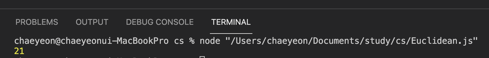

# 유클리드 호제법
- 정의
- 공식
- 예제
- 응용(최소공배수 구하기)

## You can answer
- 유클리드 호제법이 무엇인지 알 수 있다.
- Javascript, python으로 작성할 수 있다.
---
<br/>

### 정의
> 2개의 자연수의 최대공약수를 구하는 알고리즘이다.  
> 시간복잡도 O(logN) 이다.

### 공식 
> 최대공약수 구하는 함수를 gcd(x,y)로 가정함(단, x>y)   
> 1. x % y = 0 이면, gcd(x,y) = y가 성립
> 2. x % y != 0 이면, gcd(x,y) = gcd(x, x % y)가 성립
> 3. 1이 될때까지 반복

<br/>

### 예제
---
### JS
``` javascript
function gcd(x,y){
    // y가 0이 될때까지 반복
    while(y>0){
    // y를 x에 대입
    // y에 x%y를 대입
    [x,y] = [y, x%y]
    }
    return x
}
  
console.log(gcd(1071,1029))
```
### 결과


### python
``` python
def gcd(x,y):
    # y가 0이 될때까지 반복
    while y>0:
        # x에 y를 대입
        # y에 x%y를 대입
        x,y = y, x%y
    return x

print(gcd(10,15))
```
### 결과


---

### 응용(최소공배수 구하기)
> 두 수의 최소공배수(LCM) : 두수의 곱 / 최대공약수

### 예제
---
### JS
```javascript
function gcd(x,y){
    // y가 0이 될때까지 반복
    while(y>0){
    // y를 x에 대입
    // y에 x%y를 대입
    [x,y] = [y, x%y]
    }
    return x
}

function lcm(a,b){
    return (a*b) / gcd(a,b)
}

console.log(lcm(1071,1029)) // 52479
```

### python
``` python
def gcd(x,y):
    # y가 0이 될때까지 반복
    while y>0:
        # x에 y를 대입
        # y에 x%y를 대입
        x,y = y, x%y
    return x
def lcm(a,b):
    return a*b // gcd(a,b)

print(lcm(10,15)) # 30
```
참고
> python은 Math라이브러리를 통해 gcd(), lcm()을 제공하다.   
> 단. gcd()는 python v3.5부터 lcm()은 v3.9부터 사용가능하다.

<br/>

# References
- [Python Math라이브러리](https://wikidocs.net/106252)
- [관련 문제(N개의 최소공배수)](https://programmers.co.kr/learn/courses/30/lessons/12953)