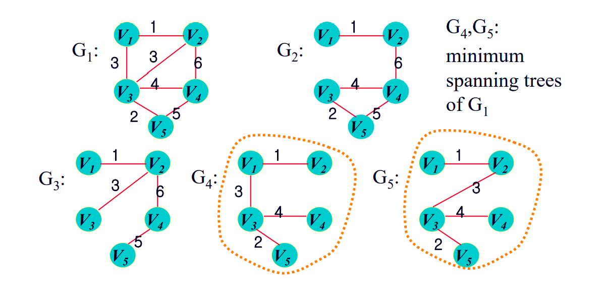

# Minimal Spanning Tree
    - Spanning Tree 中 가중치의 합이 가장 최소인 것

### Minial Spanning Tree의 사례
- 객체(node)들을 최소의 길이로 연결할 때
1. 도로 건설
- 도시들을 연결하여 도로의 길이가 최소가 되도록 한다
2. 통신
- 통신선의 길이가 최소가 되도록 망을 구성한다

## Spanning Tree란?
- 최소 연결 부분 그래프, n개의 node를 가진 Spanning Tree는 반드시 (n - 1)개의 edge를 가진다
- 특징 : undirected, connected, acyclic

- G&#8321; 으로부터 G&#8323;, G&#8324;, G&#8325; 이라는 Spanning Tree가 파생 되었고, 그중 가중치가 가장 작은 G&#8324;, G&#8325; 이 Minimal Spanning Tree가 되었다

### Minial Spanning Tree의 특징
1. 간선의 가중치의 합이 최소이어야 한다
2. n 개의 node를 가지는 그래프에 대해 edge는 n-1 개여야 한다
3. 사이클이 포함되서는 안된다
4. 모든 정점은 연결되어 있어야한다
5. 방향성이 없어야 한다

### Minial Spanning Tree의 구현
- Prim's Algorithm
- Kruskal's Algorithm