# KMP Algorithm

- KMP 알고리즘이란?
- 과정
- 구현
- 예시


## You Can Answer
- KMP 알고리즘이란 무엇인가요?
- KMP 알고리즘은 어떻게 진행되나요?

## KMP 알고리즘이란?
현재까지 일치했었던 검색어의 부분 문자열 정보를 활용하여 전체 문자열에서, 특정 문자열을 빠르게 찾는 알고리즘이다. pi 배열을 만드는 시간 m(검색어의 길이), 주어진 문자열에서 검색어를 찾는 시간 n으로 시간 복잡도는 O(n+m)이다.

## 과정


Text 문자열에서 Search 문자열을 찾는 도중 중간에서 “ABDAB” 부분까지는 일치했는데 검색어의 마지막 글자인 “B”에서 불일치가 발생했다고 가정하자.


Search 문자열에서 “ABDABB” 중, 앞에 일치했던 “ABDAB”에서 <U>A B</U> D <U>A B</U> 이렇게 접두사 A B와 접미사 A B가 같다. A B는 접두사와 접미사가 같은 부분의 최대 길이(2)가 된다. 이보다 더 긴 접두사=접미사 는 없다.


검색어를 굳이 처음부터 다시 검사할 필요없이 AB는 이미 일치했다고 치고 AB의 다음 글자인 D부터 검사하면 된다. 즉, “AB”를 위와 같이 걸칠 수 있다.

## 구현

KMP 알고리즘으로 문자열을 검색하기 전에 인덱스 별로 접두사=접미사의 최대 길이를 미리 구해놓아야 시간 복잡도 면에서 효율적이다. 여기서 접두사=접미사의 최대 길이를 저장해놓은 배열을 실패 함수라고 부른다.
text : 전체 문자열
pattern : 검색어


``` java
vector<int> Fail(string pattern) {
	int m = pattern.length();
	vector<int> pi(m); // 접두사=접미사의 최대 길이를 저장해놓은 배열

	pi[0] = 0;
	for (int i = 1, j = 0; i < m; i++) {
		while (j > 0 && pattern[i] != pattern[j])
			j = pi[j - 1];
		if (pattern[i] == pattern[j])
			pi[i] = ++j;
	}
	return pi;
}
```

</br>
그림에서 LPS 배열이 코드에서의 pi 배열을 뜻한다.
윗부분 search 배열을 search1, 아랫부분 search 배열을 search2라 하겠다.
노란색 화살표는 search1의 텍스트 포인터(i), 초록색 포인터는 search2의 검색어 포인터(j)다.

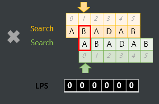

search1[i]와 search2[j]가 다르므로 걸치기 작업이 필요하지만 j=0이라 search2[j]부터 배열의 앞부분에 일치하는게 없다.


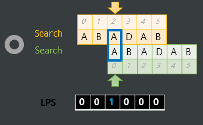

search1[i]와 search2[j]가 같으므로 p[i]에 j+1을 넣어주고 i와 j를 1증가시킨다.

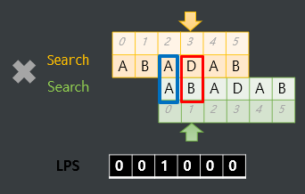

search1[i]와 search2[j]가 다르므로 j를 p[j-1](p[0] = 0)으로 값을 바꾼다.


search1[i]와 search2[j]가 다르므로 걸치기 작업이 필요하지만 j=0이라 search2[j]부터 배열의 앞부분에 일치하는게 없다.

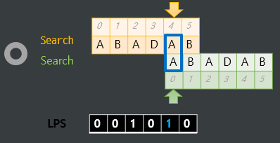

search1[i]와 search2[j]가 같으므로 p[i]에 j+1을 넣어주고 i와 j를 1증가시킨다.

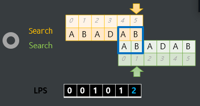

search1[i]와 search2[j]가 같으므로 p[i]에 j+1을 넣어주고 i가 문자열 전체를 돌았으므로 종료한다.

``` java
vector<int> KMP(string pattern, string text) {
	int m = pattern.length(); // 검색어의 길이
	int n = text.length(); // 텍스트의 길이
	vector<int> pos;  // 검색에 성공한 위치를 pos 에 저장할 것
	vector<int> pi = Fail(pattern); // 전처리 과정. pi 배열 구해놓기!

	for (int i = 0, j = 0; i < n; i++) {
		while (j > 0 && text[i] != pattern[j])// 일치 하거나 하나도 일치하는게 없는 상태(j = 0 (즉, 검색어 첫 글자부터 검사해야 하는 상태)가 될 때까지 계속해서 최대 길이의 접두사 = 접미사 부분의 접두사를 걸치자!
			j = pi[j - 1];
		if (text[i] == pattern[j]) { // 일치한다면
			if (j == m - 1) { // 검색에 성공한 경우 (그 이전의 m - 1 개도 모두 일치. 총 m 개가 일치하는 셈)
				pos.push_back(i - m + 1); // 검색 성공한 일치 문자열의 시작 인덱스는 i - m + 1
				j = pi[j]; // j = pi[m - 1] 와 같음
			}
			else j++; // 일치하면 자연스레 검색어의 다음 원소 검사하러 가면 된다.
		}
	}
	return pos;
}
```


## 예시

노란색 화살표는 텍스트 포인터(i), 초록색 포인터는 검색어 포인터(j)다.

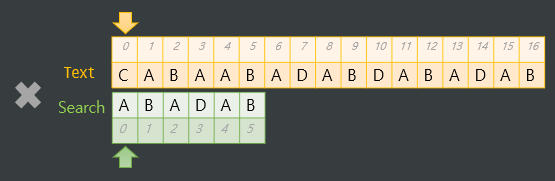

text[i]와 search[j]가 다르므로 걸치기 작업이 필요하지만 j=0이라 search[j]부터 배열의 앞부분에 일치하는게 없다.

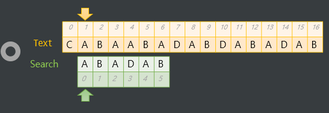

text[i]와 search[j]가 같으므로 걸치기 작업이 진행 안되고 j가 1 증가한다.

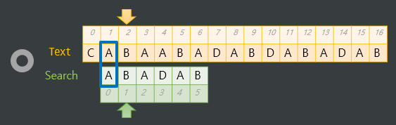

위와 동일

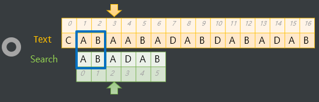

위와 동일


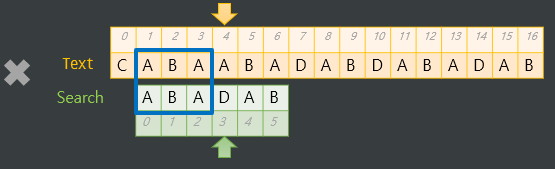

text[i]와 search[j]가 다르므로 걸치기 작업이 진행된다. j의 값을 p[j-1](p[2] = 1)로 바꾸어 준다. 그럼 아래와 같이 search 부분이 옮겨진다.

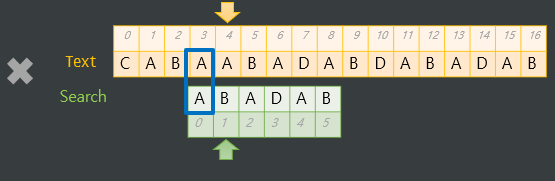

text[i]와 search[j]가 다르므로 걸치기 작업이 진행된다. j의 값을 p[j-1](p[0] = 0)로 바꾸어 준다. 그럼 아래와 같이 search 부분이 옮겨진다.

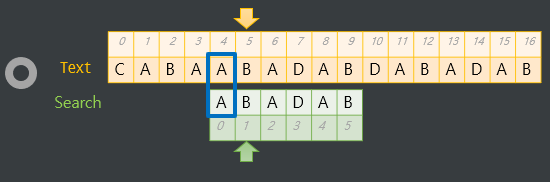

text[i]와 search[j]가 같으므로 걸치기 작업이 진행 안되고 j가 1 증가한다.

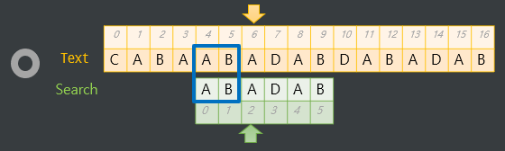

text[i]와 search[j]가 같으므로 걸치기 작업이 진행 안되고 j가 1 증가한다.

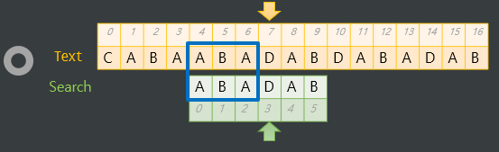

text[i]와 search[j]가 같으므로 걸치기 작업이 진행 안되고 j가 1 증가한다.

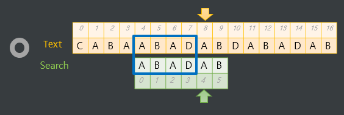

text[i]와 search[j]가 같으므로 걸치기 작업이 진행 안되고 j가 1 증가한다.

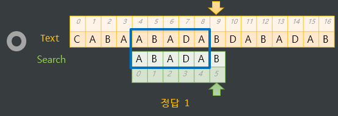

text[i]와 search[j]가 같으므로 걸치기 작업이 진행 안되고 j의 값이 search.length() - 1 이므로 해당 문자열을 찾은 것이다. 만약 뒤에 search 문자열과 일치하는 것이 존재하는지 더 보려면 j의 값을 p[j](p[5] = 2)로 바꾼 후 진행하면 된다. 그럼 아래와 같이 search 부분이 옮겨진다.

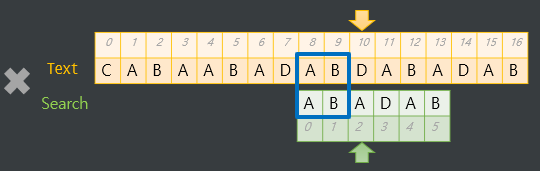

## Reference
- [문자열 검색 알고리즘 : KMP 알고리즘](https://ansohxxn.github.io/algorithm/kmp/#site-nav)
