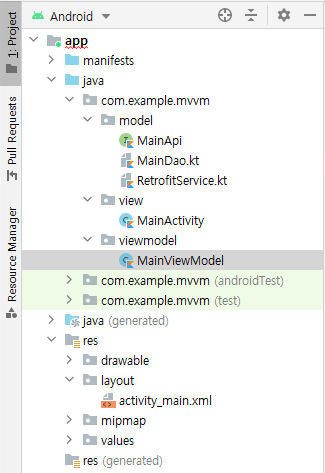

# MVVM
<!--Table of Contents-->
- MVVM 란?
- MVVM 처리과정
- MVVM 예제코드
- MVVM 특징

<!-- 어떤 질문을 대답할 수 있어야 하는지-->
## You can answer
- MVVM 란 무엇인가요 ?

<!--Contents-->

---
## MVVM 란?
- 정의
  * Android Architecture Pattern 중 하나로 Model, View, ViewModel 세 가지의 구성요소로 나뉜다.

- Model
  * 어플리케이션에서 사용되는 데이터와 그 데이터를 처리하는 비즈니스 로직을 갖고 있는 부분이다.
  * View나 ViewModel에 독립적이기 때문에 재사용이 가능하다.

- View
  * 사용자에게 보여지는 UI부분으로 안드로이드에서는 Activity나 Fragment에 해당한다.
  * ViewModel을 관찰하고 있다가 데이터가 전달되면 사용자에게 보여준다.

- ViewModel
  * Model과 View 사이의 매개체라는 점에서 MVP의 Presenter와 유사하지만 MVP와 다르게 View와 ViewModel은 1:n의 관계를 가질 수 있으며, 여러개의 Fragment가 하나의 ViewModel을 가질 수 있다.
  * Model을 이용해 View에게 전달하기 좋은 데이터를 가공한다.

## MVVM 처리과정
  
  ### 처리 순서
  1) View로 사용자의 입력이 들어온다.
  2) View는 View Model에 이벤트를 전달한다.
  3) View Model은 필요한 데이터를 Model에 요청하고, Model은 요청받은 데이터를 View Model에게 응답한다.
  4) View Model은 응답받은 데이터를 가공하여 저장하고, View는 View Model의 관찰을 통해 얻은 데이터로 화면을 나타낸다.

## MVVM 예제코드
- MVVM 패키지 구조

&nbsp;&nbsp;
    View는 ViewModel의 Observable data 변화를 감지하여 화면을 나타낸다는 특징이 있다.
<br>

- MainActivity
```Kotlin
class MainActivity : AppCompatActivity() {
    private val binding: ActivityMainBinding by lazy {
        DataBindingUtil.setContentView(
            this,
            R.layout.activity_main
        )
    }

    override fun onCreate(savedInstanceState: Bundle?) {
        super.onCreate(savedInstanceState)
        binding.run {
            viewModel = MainViewModel()
        }
    }
}
```
<br>

- MainViewModel
```Kotlin
class MainViewModel {
    val item = ObservableField<item>()
    val stationName = ObservableField<String>()

    fun callItem() {
        CoroutineScope(Dispatchers.IO).launch {
            try {
                val info = MainService.retrofitService.listAir(
                    BuildConfig.airKoreaKey,
                    "json",
                    2,
                    1,
                    stationName.get().toString(),
                    "DAILY",
                    1.0
                ).body()!!.response.body.items[0]
                item.set(info)
            } catch (e: Exception) {
                Log.e("network error", e.toString())

            }
        }
    }
}
```
<br>

- activity_main.xml
```xml
<layout xmlns:android="http://schemas.android.com/apk/res/android"
    xmlns:app="http://schemas.android.com/apk/res-auto"
    xmlns:tools="http://schemas.android.com/tools">

    <data>
        <variable
            name="viewModel"
            type="com.example.mvvm.viewmodel.MainViewModel" />
    </data>

    <LinearLayout
           android:layout_width="match_parent"
           android:layout_height="wrap_content"
           android:gravity="center"
           android:orientation="horizontal">

           <EditText
               android:id="@+id/editName"
               android:layout_width="100dp"
               android:layout_height="wrap_content"
               android:text="@={viewModel.stationName}"/>
           </EditText>

           <Button
               android:id="@+id/btnSearch"
               android:layout_width="wrap_content"
               android:layout_height="wrap_content"
               android:layout_gravity="right"
               android:text="검색"
               android:onClick="@{() -> viewModel.callItem()}">
           </Button>

           <TextView
               android:layout_width="wrap_content"
               android:layout_height="wrap_content"
               android:text="미세먼지 농도">
           </TextView>

           <TextView
               android:id="@+id/pm10"
               android:layout_width="150dp"
               android:layout_height="wrap_content"
               android:text="@{viewModel.item.pm10Value}">
           </TextView>

       </LinearLayout>
```
  &nbsp;&nbsp; View는 Data Binding을 통해 MainViewModel을 연결 후 Observable Data인 item, stationName 변수를 관찰하게 된다.
  &nbsp;&nbsp; 버튼 클릭 이벤트가 발생하게 되면 ViewModel의 CallItem() 함수가 실행되고, ViewModel의 item 변수에 set을 하여 업데이트 하게 된다.
  &nbsp;&nbsp; 관찰하고 있던 ViewModel item 변수의 상태 변경을 감지하여 Data Binding 되어 있던 View를 갱신하여, 화면을 나타낸다.


## MVVM 특징
  - 장점
    * Model과 View 사이, ViewModel과 View 사이의 의존성이 없으므로 유닛테스트가 더 쉬워진다.
    * 각각의 부분은 독립적이기 때문에 중복되는 코드를 모듈화 할 수 있다.

  - 단점
    * 기존의 다른 패턴들에 비해 추가로 만들어야 하는 클래스가 많고, 이들을 서로 연결해야줘야 하기 때문에 초기 설계가 어렵다.
    * View에 대한 처리 내용이 복잡해질수록 ViewModel도 거대해진다.

---
## Reference
- [안드로이드 아키텍처 패턴 - MVVM가 뭘까?](https://velog.io/@jojo_devstory/%EC%95%88%EB%93%9C%EB%A1%9C%EC%9D%B4%EB%93%9C-%EC%95%84%ED%82%A4%ED%85%8D%EC%B2%98-%ED%8C%A8%ED%84%B4-MVVM%EC%9D%B4-%EB%AD%98%EA%B9%8C)
- [MVC, MVP, MVVM 예제 코드](https://github.com/rkdmf1026/AndroidArchitectureTest)
