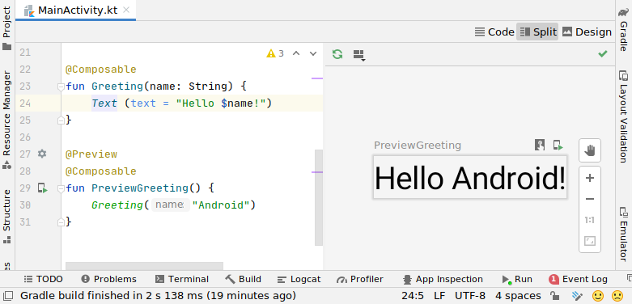

# Jetpack Compose
<!--Table of Contents-->
- Jetpack Compose 란?
- Jetpack Compose 예제코드
- Jetpack Compose 특징

<!-- 어떤 질문을 대답할 수 있어야 하는지-->
## You can answer
- Jetpack Compose 란 무엇인가요 ?

<!--Contents-->

---
## Jetpack Compose 란?
- Jetpack Compose는 Android를 위한 현대적인 선언형 UI 도구 키트로 Native UI를 코드레벨로 구현할 수 있다.


## Jetpack Compose 예제코드
```Kotlin
class MainActivity : ComponentActivity() {
    override fun onCreate(savedInstanceState: Bundle?) {
        super.onCreate(savedInstanceState)
        setContent {
            Greeting("Android")
        }
    }
}

@Composable
fun Greeting(name: String) {
    Text (text = "Hello $name!")
}

@Preview
@Composable
fun PreviewGreeting() {
    Greeting("Android")
}
```
- setContent는 액티비티의 레이아웃을 정의합니다.
기존의 XML 파일로 레이아웃 콘텐츠를 정의하는 대신 Composable function을 호출한다.
- @Composable 어노테이션을 추가하여 Composable function을 만들 수 있다.
Composable function 내부에는 Text와 같은 함수들이 존재하고, 이를 통해 UI계층 별 요구하는 컴포넌트를 생성해준다.
- @Preview 어노테이션을 추가하면 아래 사진과 같이 Android 기기나 에뮬레이터 없이도 IDE 내에서도 Composable function의 Preview가 가능하다.

  [Preview]
  

## Jetpack Compose 특징

### 기존 방식과의 차이점
- 기존 명령형 UI 방식(Imperative UI)
  * 기존의 명령형 UI 방식은 XML을 사용하여 UI를 그리게 되면서 View와 데이터 사이에 중간 계층(findViewById())이 하나 끼어들어야만 하는 형태이다. Data는 View에 어떤 id값이 있는지, 어떤 View를 포함하려 하는지 알고 있어야 하기 때문에 둘은 강한 의존성을 갖게된다.
  * View를 수동으로 조작하게되면 오류가 발생할 가능성이 커진다. 예를 들어 View를 수정하게 되면 데이터의 코드 또한 수정해야하고, 이때 하나라도 놓치게 되면 오류가 발생하게 된다.
- Jetpack Compose의 선언형 UI 방식(Declartive UI)
  * Jetpack Compose의 선언형 UI 방식은 데이터를 입력받으면 Composable function을 사용하여 UI를 그려주는 형태이다.
  * 기존의 명령형 UI 방식과 다르게 강한 의존성을 갖게 하는 중간계층이 없기 때문에 UI 변경시, 단순히 Composable function만 수정하면 된다.
### 장점
- 코드 감소
  * 간단한 코드로 더 많은 작업을 할 수 있고, 낮은 버그율 및 유지 관리가 쉽다.
- 직관적
  * UI 관련 코드를 작성하면 나머지 처리를 Compose가 처리하며, 변경 상태에 대한 UI 갱신을 자동으로 처리해 준다.
- 빠른 개발 과정
  * 기존 코드와 호환이 가능하여, 원하는 대로 작업 가능하고 실시간 미리 보기를 Android Studio를 통해 지원한다.
- 강력한 성능
  * Android 플랫폼 API에 직접 액세스하고, 머트리얼 디자인, Night 모드, 애니메이션 등을 기본적으로 지원한다.

---
## Reference
- [Jetpack Compose Basics](https://developer.android.com/jetpack/compose/tutorial)
- [Jetpack Compose가 필요한 이유(Mental Model)](https://wooooooak.github.io/jetpack%20compose/2021/05/18/%EC%BB%B4%ED%8F%AC%EC%A6%88%EA%B0%80%ED%95%84%EC%9A%94%ED%95%9C%EC%9D%B4%EC%9C%A0/)
