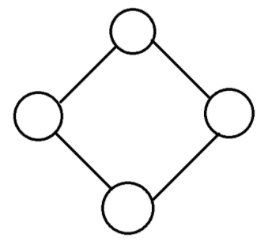
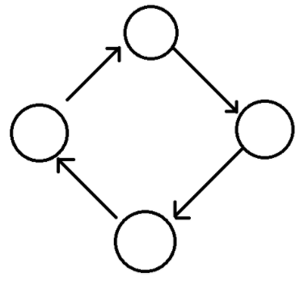
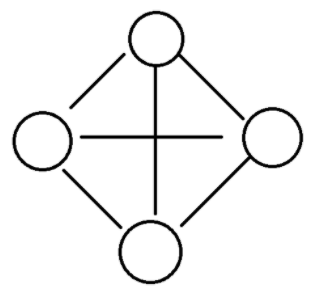

# Graph
## 목차
- 그래프(Graph)의 개념 및 사용
- 그래프(Graph)의 용어정리
- 그래프(Graph)의 구현 방법
- 그래프(Graph)의 종류

## You can answer
- 그래프가 무엇인가요?!
- 그래프의 장점이 뭔가요?!

---
## 그래프의 개념 및 사용

### 그래프란?
    그래프는 정점(Vertex)과 정점을 연결하는 간선(Edge)으로 이루어진 비선형 자료구조로 정점간의 관계를 표현한다.
    트리와는 달리 그래프는 정점마다 간선이 없을수도 있으며, 루트 노드, 부모와 자식 개념이 존재하지 않는다.

### 그래프의 사용
    그래프는 일상생활에서 연결되어있는 객체 간의 관계를 표현할 때 사용된다.
    예로 지도나 지하철 노선도, 전기회로, 도로 등을 들 수 있다. 또한 컴퓨터 세부전공에서는 통신 네트워크 분야에서도 쓰이며, 논리회로를 설계하고 분석하는 데에도 사용된다.
    최근에는 웹사이트의 링크 연결(Page Rank)이나 SNS 상의 친구관계를 표현하는 데에도 사용되고 있다.

## 그래프 용어 정리
  1. 정점(vertex) : 노드(node)라고도 하며 정점에는 데이터가 저장된다.
  2. 간선(edge): 링크(arcs)라고도 하며 노드간의 관계를 나타낸다.
  3. 인접 정점(adjacent vertex) : 하나의 간선에 의해 직접 연결된 정점이다.
  4. 경로(path) : 특정 정점에서 다른 정점으로 가는 간선의 리스트이다.
  5. 차수(degree) : 무방향 그래프에서 하나의 정점에 인접한 정점의 수를 뜻한다.
  6. 진출 차수(out-degree) : 방향그래프에서 사용되는 용어로 한 노드에서 외부로 향하는 간선의 수를 뜻한다.
  7. 진입차수(in-degree) : 방향그래프에서 사용되는 용어로 외부 노드에서 들어오는 간선의 수를 뜻한다.

  

## 그래프의 구현 방법
그래프를 구현하는 방법에는 인접행렬(Adjacency Matrix)와 인접리스트(Adjacency List)방식이 다. 두개의 구현 방식은 각각의 상반된 장단점을 가지고 있는데 대부분 인접리스트 형식을 많이들 사용한다.

### 인접행렬 방식

인접행렬은 그래프를 구성하는 정점에 대해서 두 정점을 연결한 간선의 유무를 2차원 배열에 저장해 만드는 방법이다.
완성된 배열의 모양은 위 그림과 같이 1,2,3,4,5,6 각각의 정점과 연결되는 정점이 있다면 1, 아니면 0을 넣어준다.

#### 인접행렬 장점
1. 2차원 배열 안에 모든 정점들의 간선 정보를 담기 때문에 배열의 위치를 확인하면 두 점에 대한 연결 정보를 조회할 때 O(1) 의 시간 복잡도면 가능하다.
2. 구현이 비교적 간편하다.

#### 인접행렬 단점
1. 모든 정점에 대해 간선 정보를 대입해야 하므로 O(n²) 의 시간복잡도가 소요된다.
2. 무조건 2차원 배열이 필요하기에 필요 이상의 공간이 낭비된다.

### 인접리스트 방식

인접리스트란 그래프의 정점들을 리스트로 표현한것이다.
주로 정점의 리스트 배열을 만들어 관계를 설정해줌으로써 구현한다.

#### 인접리스트 장점
1. 정점들의 연결 정보를 탐색할 때 O(n) 의 시간이면 가능하다. (n: 간선의 갯수)
2. 필요한 만큼의 공간만 사용하기때문에 공간의 낭비가 적다.

#### 인접리스트 단점
1. 특정 두 점이 연결되었는지 확인하려면 인접행렬에 비해 시간이 오래 걸린다. (배열보다 search 속도느림)
2. 구현이 비교적 어렵다.

## 그래프의 종류

### 무방향 그래프

무방향 그래프는 두 정점을 연결하는 간선에 방향이 없는 그래프이다.

### 방향 그래프

방향 그래프는 두 정점을 연결하는 간선에 방향이 존재하는 그래프이다.
간선의 방향으로만 이동이 가능하다.

### 가중치 그래프

가중치 그래프는 두 정점을 이동할 때 해당 가중치만큼 비용이 드는 그래프이다.

### 완전 그래프

완전 그래프는 모든 정점이 간선으로 연결되어 있는 그래프이다.

---
## Reference
- [자료구조 그래프(Graph)란 무엇인가?](https://coding-factory.tistory.com/610)
- [자료구조 - 그래프](https://hini7.tistory.com/97)
