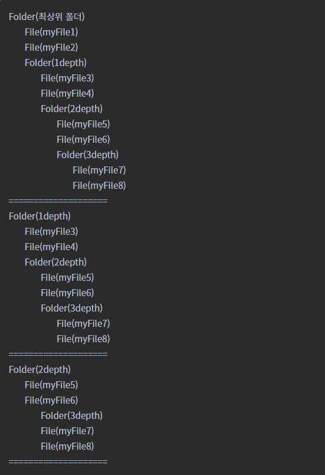

# 컴포지트 패턴(Composite Pattern)

<!--Table of Contents-->
- 컴포지트 패턴이란?
- 컴포지트 패턴의 장단점
- 컴포지트 패턴의 구현예시

## You Can Answer
- 컴포지트 패턴이란 무엇인가요?
- 컴포지트 패턴은 언제 사용하나요?
- 컴포지트 패턴을 사용함으로써 이점이 무엇이 있나요?

## 컴포지트 패턴 이란?
- 객체들의 관계를 트리 구조로 구성하여 부분-전체 계층을 표현하는 패턴으로, 사용자가 단일 객체와 그 객체를 포함하는 복합 객체 모두 동일하게 다룬다.
- 객체들 간에 계급 및 계층구조가 있고 이를 표현할 때, 클라이언트가 단일 객체와 복합 객체를 구분하지 않고 동일한 형태로 사용하고자 할 때 사용된다.


  - Component: 집합 관계에 정의될 모든 객체에 대한 인터페이스를 정의한다. 모든 클래스에 해당하는 공통의 행동을 구현한다.
  - Leaf: 가장 말단 객체, 자식이 없고 객체 합성에 가장 기본이 되는 객체의 행동을 정의한다.
  - Composite: 자식이 있는 구성 요소에 대한 행동을 정의함 자신이 복합하는 요소들을 저장하면서, Component 인터페이스에 정의된 자식 관련 연산을 구현한다.

## 장단점
- 장점
  - 객체들이 모두 같은 타입으로 취급되기 때문에 새로운 클래스 추가가 용이하다.
  - 단일객체, 복합객체 구분하지 않고 동일한 코드로 작성되기 때문에 코드가 단순해진다.
- 단점
  - 설계를 일반화 시켜 객체간의 구분, 제약이 힘들다.

## 구현 예시
컴포지트 패턴을 적용하여 파일-폴더 구조를 구현한다.

1) FileSystem.java [Interface]
```java
ppublic interface FileSystem {
    public void print();
}
```
&nbsp;&nbsp; File과 Folder를 추상화한 FileSystem 인터페이스는 간단히 print만 찍는 추상 메소드를 갖는 인터페이스이다.

2) File.java [Class]
```java
public class File implements FileSystem {
    private String name;

    @Override
    public void print() {
        System.out.println(this.getClass().getSimpleName() + "(" + name + ")");
    }

    public File(String name) {
        this.name = name;
    }
}
```
&nbsp;&nbsp; File 클래스는 단일객체(Leaf)로 표현된다. 따라서 자신의 이름을 갖는 name 이라는 필드만 존재한다.

3) Folder.java [Class]
```java
public class Folder implements FileSystem {
    private String name;
    private List<FileSystem> files = new ArrayList<>();

    @Override
    public void print() {
        System.out.println(this.getClass().getSimpleName() + "(" + name + ")");
        files.forEach(fileSystem -> fileSystem.print());
    }

    public void addFile(FileSystem file) {
        files.add(file);
    }

    public Folder(String name) {
        this.name = name;
    }
}
```
&nbsp;&nbsp; Folder 클래스는 복합객체(Composite)로 사용되며, FileSystem 타입의 List를 갖고 있다.
인스턴스 메소드로 갖고 있는 addFile()은 FileSystem 타입의 인스턴스를 저장하는데 File과 Folder 모두 FileSystem 타입이기 때문에 모두 들어올 수 있다.

4) Main.java [Class]
```java
public class Main {

    public static void main(String[] args) {

        Folder folder1 = new Folder("최상위 폴더");
        File myFile1 = new File("myFile1");
        File myFile2 = new File("myFile2");
        folder1.addFile(myFile1);
        folder1.addFile(myFile2);

        Folder folder2 = new Folder( "1depth");
        File myFile3 = new File("myFile3");
        File myFile4 = new File("myFile4");
        folder2.addFile(myFile3);
        folder2.addFile(myFile4);

        Folder folder3 = new Folder("2depth");
        File myFile5 = new File("myFile5");
        File myFile6 = new File("myFile6");
        folder3.addFile(myFile5);
        folder3.addFile(myFile6);

        Folder folder4 = new Folder("3depth");
        File myFile7 = new File("myFile7");
        File myFile8 = new File("myFile8");
        folder4.addFile(myFile7);
        folder4.addFile(myFile8);

        folder1.addFile(folder2);
        folder2.addFile(folder3);
        folder3.addFile(folder4);

        folder1.print();
        System.out.println("====================");
        folder2.print();
        System.out.println("====================");
        folder3.print();
        System.out.println("====================");
    }
}
```
&nbsp;&nbsp; 4개의 Folder 인스턴스와 각각 여러개의 File 인스턴스를 넣어서 파일-폴더 구조를 형성했다.
File과 Folder는 모두 하나의 인터페이스로 통일되었기 때문에 folder1.addFile(folder2); 형태로 연결이 가능하다.

5) 실행 결과



## Reference
- [컴포지트(Composite) 패턴 Feat.Java](https://sup2is.github.io/2020/06/25/composite-pattern.html)
