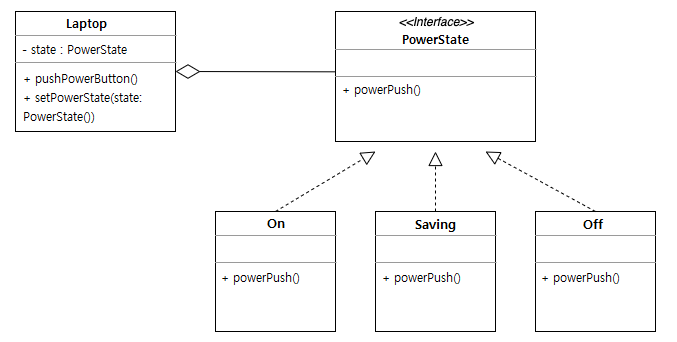
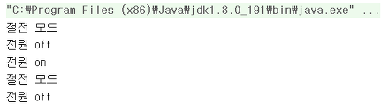

# 상태 패턴(State Pattern)

## 상태 패턴이란?
상태 패턴은 객체가 특정 상태에 따라 행위를 달리하는 상황에서, 자신이 직접 상태를 체크하여 상태에 따라 행위를 호출하지 않고, 상태를 객체화하여 상태가 행동을 할 수 있도록 위임하는 패턴을 말한다.


## You Can Answer
- 상태 패턴이란 무엇인가요?
- 상태 패턴은 언제 사용하나요?
- 상태 패턴을 사용함으로써 이점이 무엇이 있나요?

## 사용하는 이유
객체들을 상태에 따라 행동을 다르게 해야하는 상황이 있다. 이 때 가장 간단한 방법이 if/else문, switch문을 사용하는 것인데, 이런 구조는 새로운 상태를 추가하는 경우에 많은 메서드를 변경해야 하므로 유지보수가 어려워진다. 따라서 상태 패턴을 사용하여 조건문을 제거하여 상태 객체를 통해 각 객체의 상태가 표현된다.

## 장단점
- 장점
  - 하나의 객체에 대한 여러 동작을 구현해야할 때 상태 객체만 수정하므로 동작의 추가, 삭제 및 수정이 간단해진다.
  - 객체의 상태에 따른 조건문(if/else문, switch문)이 줄어들어 코드가 간결해지고 가독성이 올라간다.
- 단점
  - 상태에 따른 조건문을 대신한 상태 객체가 증가하여 관리해야할 클래스의 수가 증가한다.
  - 상태에 따라 변하는 메서드의 수가 적다면 오히려 불필요한 복잡성을 추가할 수 있다.

## 구현 예시
노트북은 켜고 끌 수 있지만 그 사이에 절전모드를 추가한다고 가정하겠다.
- 노트북 전원이 켜져 있는 상태에서 전원 버튼을 누르면, 전원이 꺼진다.
- 노트북 전원이 꺼져있는 상태에서 전원 버튼을 누르면, 절전모드가 된다.
- 노트북이 절전모드인 상태에서 전원 버튼을 누르면, 전원이 켜진다.





1) 전원 상태를 캡슐화한 인터페이스를 선언한다.
```java
public interface PowerState {
	public void powerPush();
}
```

2) PowerState 인터페이스를 구현한 각 상태 클래스를 정의한다.
```java
// On 상태
public class On implements PowerState {
    public void powerPush(){
        System.out.println("전원 off");
    }
}
```
```java
// Off 상태
public class Off implements PowerState {
    public void powerPush(){
        System.out.println("절전 모드");
    }
}
```

```java
// 절전 상태
public class Saving implements PowerState {
    public void powerPush(){
        System.out.println("전원 on");
    }
}
```

3) Laptop 클래스를 정의한다.
```java
public class Laptop {
    private PowerState powerState;

    public Laptop(){
        this.powerState = new Off();
    }

    public void setPowerState(PowerState powerState){
        this.powerState = powerState;
    }

    public void pushPowerButton(){
        powerState.powerPush();
    }
}
```

4) Laptop 객체를 사용하는 Client 클래스를 정의한다.
```java
public class Client {
    public static void main(String args[]){
        Laptop laptop = new Laptop();
        On on = new On();
        Off off = new Off();
        Saving saving = new Saving();

        laptop.pushPowerButton();
        laptop.setPowerState(on);
        laptop.pushPowerButton();
        laptop.setPowerState(saving);
        laptop.pushPowerButton();
        laptop.setPowerState(off);
        laptop.pushPowerButton();
        laptop.setPowerState(on);
        laptop.pushPowerButton();
    }
}
```

5) 결과




## Reference
- [스테이트 패턴(State Pattern)](https://victorydntmd.tistory.com/294)
- [상태 패턴(State Pattern)](https://always-intern.tistory.com/9)
- [State 패턴](https://kscory.com/dev/design-pattern/state)
