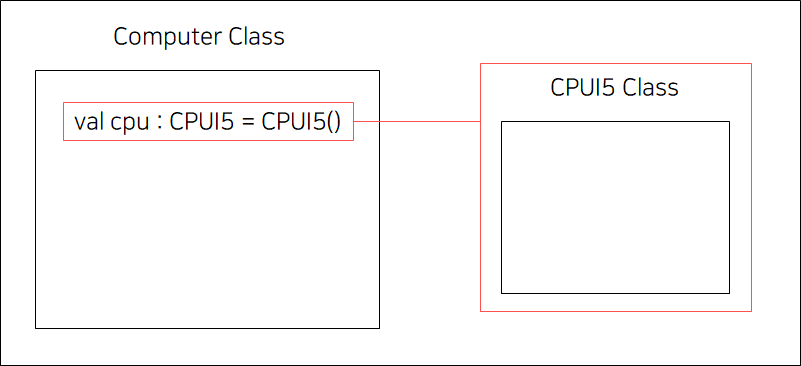
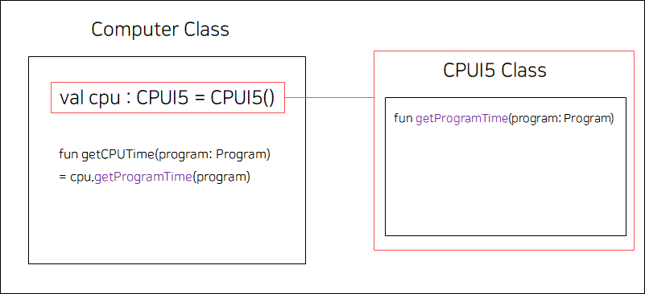
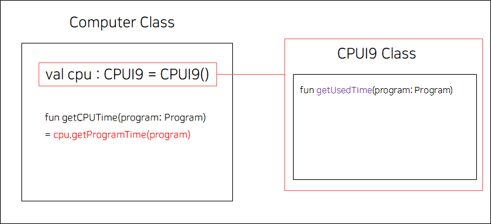
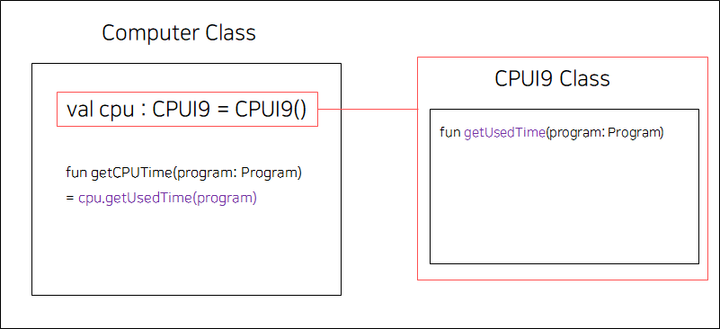
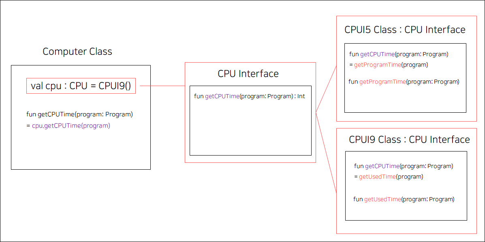
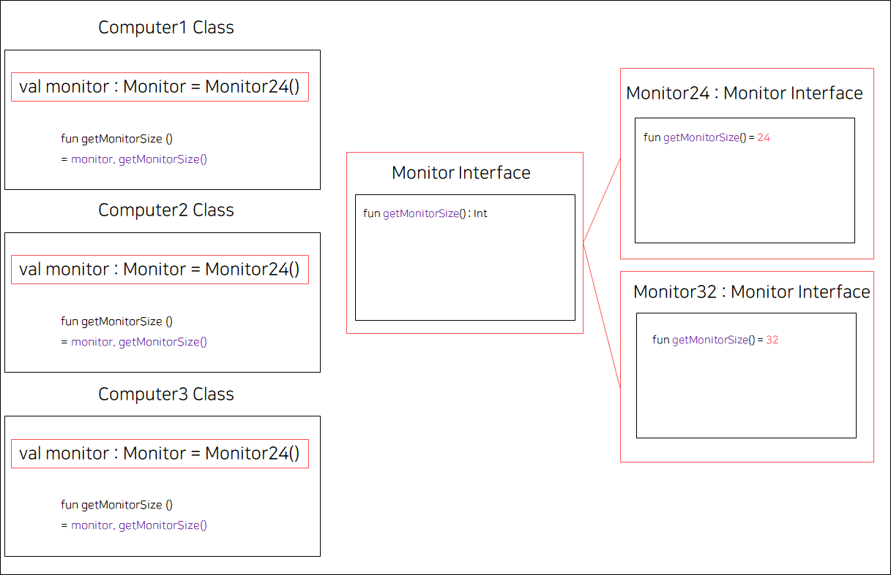
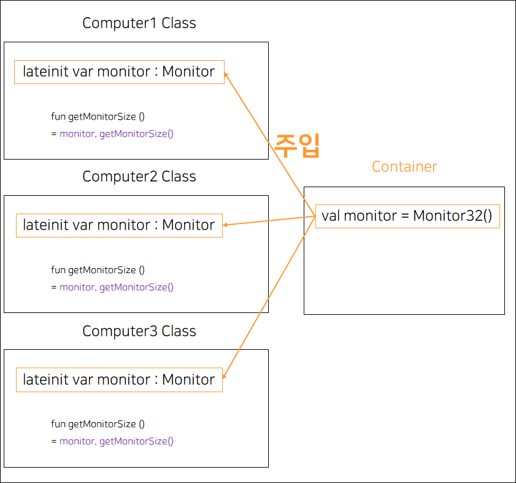

# 의존성 주입(Dependency Injection)

## 목차
- 의존성이란?
- 의존성 주입이란?
- 의존성 주입의 의의

## You can answer
- 의존성 주입이란 무엇인가?
- 의존성 주입은 왜 필요한가?

---
## 의존성이란?
객체 지향 프로그래밍에서 클래스간에 의존성이 있다는 것은 클래스간에 의존 관계가 있다는것을 뜻한다. 즉, 클래스 간에 의존 관계가 있다는 것은 한 클래스가 바뀔 때 다른 클래스가 영향을 받는다는 것을 뜻한다.

### 의존성 예제
Computer와 CPU가 있고 컴퓨터를 만들기 위해서는 CPU가 필요하다. i5 intel cpu가 있을 때, Computer는 그림1과 같이 객체 지향적으로 설계할 수 있다.

[그림1]

그림1에서 특정한 프로그램이 CPU를 사용한 시간을 구하기 위한 메서드를 추가해달라는 것이 요구사항으로 들어왔다. 이를 위해서는 그림2와 같이 Computer Class에 getCPUTime(program: Program) 메서드를 넣으면 된다.

[그림2]

그런데 갑자기 요구 사항이 바뀌어 성능이 더 높은 CPU로 변경이 필요해졌다. 즉, CPUI5를 CPUI9으로 바꾸는 것이 필요해졌다. 문제는 CPUI9 Class에서는 더이상 CPUTime을 getProgramTime메서드로 가져오지 않는다. 이런 경우 우리는 기존 Computer Class에서 사용했던 getCPUTime function을 사용하지 못하게 된다. 해당 메서드를 수행해야 하는데 없으므로 오류가 생기게 된다.

[그림3]

따라서 그림3의 Computer을 다시 동작하게 하기 위해서는 그림4와 같이 메서드 명을 수정해야 한다. 이렇게 할 경우 이제 다시 CPU에서 CPU Time을 가져올 수 있다.

[그림4]

그림4에서는 바뀌는 클래스에 영향을 받는 부분이 1줄이었지만 해당 클래스에 영향을 받는 부분이 많다면 클래스 하나를 수정함으로써 영향을 받는 모든 코드를 수정해야 한다. 만약 100줄의 코드가 영향을 받았으면? 100줄의 코드를 수정해야 한다. 이렇게 할 경우 코드에 변경이 있을 경우 해당 변경에 의존성을 갖는 한 코드라도 수정을 하지 않은 곳이 있다면 오류를 발생시킬 것이기 때문에 코드의 품질은 물론 안정성이 떨어진다.

[그림5]

이러한 점을 방지하기 위해 그림5와 같이 인터페이스(Interface)를 사용하여 클래스로부터 의존성을 없앤다. 이렇게 되면 Computer Class의 cpu에는 CPUI5 Class와 CPUI9 Class 둘 다 들어갈 수 있게 된다. 인터페이스의 메서드를 통해 CPU Time을 가져오므로 Computer Class는 CPU가 바뀌더라도 변경될 일이 없다.
이렇듯 인터페이스(Interface)를 이용하여 특정 클래스에 대한 의존성을 해결할 수 있다.

## 의존성 주입이란?
의존성 주입이란 클래스간 의존성을 클래스 외부에서 주입하는 것을 뜻한다.
더 자세하게는 클래스의 인스턴스를 외부에서 생성하여 주입하는 것을 뜻한다.

### 의존성 주입 예제
여러 종류의 Computer(Computer1, Computer2, Computer3)를 가진 회사가 있다. 이 컴퓨터들은 하나의 모니터를 공동으로 이용해 화면을 분할하여 컴퓨터의 연산 내용을 출력하고 있다.

[그림6]

하지만 Computer Class 내부에서 Monitor가 인스턴스화된다면 Computer Class마다 Monitor를 생성하여 들고 있게 된다. 우리는 이를 Computer가 Monitor에 강하게 결합되어 있다고 한다. 이렇게 강하게 결합되어 있을 경우 관리를 하기가 어렵다.
24인치 모니터를 32인치 모니터로 바꾸게 된다면 각 컴퓨터 클래스를 그림7과 같이 바꿔야한다.

[그림7]

모니터를 24인치에서 32인치로 바꿨을 뿐인데 3줄을 바꿔야 한다. 클래스를 변경해야 될 때, 3개 클래스 모두에서 수정이 필요하다. 관리 포인트가 늘어나는 것이다. 이를 해결하기 위해 주입을 사용한다.  

[그림8]

그림 8에서는 외부에서 Monitor 인스턴스를 만들어 Monitor가 필요한 각 클래스에 주입한다. 이러한 인스턴스를 저장하는 공간을 Container라 한다. 이제 객체에 대한 제어 권한은 Computer에 있는 것이 아닌 Container에 있다. 이를 IOC(Inversion of Control)제어의 역전 이라고 하며, 인스턴스를 저장하는 Container을 IOC Container라 한다.
이렇게 구조를 바꾼다면 Computer Class는 Monitor의 구현체를 외부에서 주입 받는 로직을 수행하는 것 위에는 신경 쓸 필요가 없어진다. 또한 굳이 여러개의 CPU 인스턴스를 만들지 않고 한 개의 Monitor인스턴스만을 사용하는 것이 메모리 측면에서도, 관리 측면에서도 편하다.

## 의존성 주입의 의의
의존성 주입으로 프로그램을 설계할 경우 다음과 같은 이점이 있다.
- 객체 간의 의존성(종속성)을 줄이거나 없엘 수 있다.
- 리팩토링이 쉬워지고, Unit Test가 용이해진다.
- 코드의 재활용성을 높여준다.
- 객체 간의 결합도이 낮추면서 유연한 코드를 작성할 수 있다.

---
## Reference
[의존성 주입이란 무엇이며 왜 필요한가?](https://kotlinworld.com/64)
