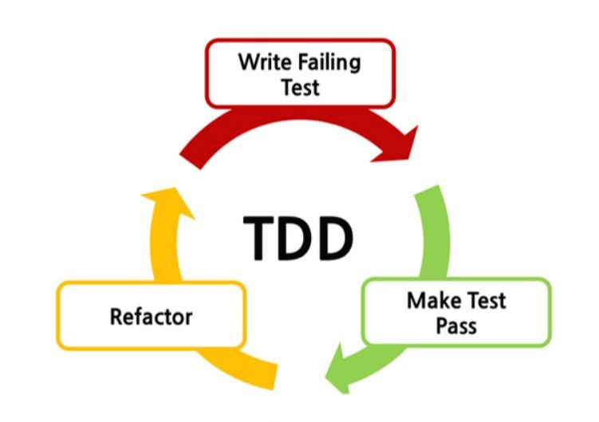
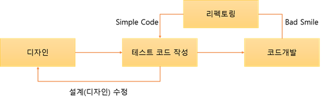

# TDD
<!--Table of Contents-->
- TDD란?
- TTD 개발 방식의 특징
- TDD 개발 방식의 장단점

## You Can Answer
- TDD란 무엇인가?
---

## TDD란?
TDD란 est Driven Development의 약자로 '테스트 주도 개발'이라고 한다. 반복 테스트를 이용한 소프트웨어 방법론으로, 작은 단위의 테스트 케이스를 작성하고 이를 통과하는 코드를 추가하는 단계를 반복하여 구현한다.
짧은 개발 주기의 반복에 의존하는 개발 프로세스이며 애자일 방법론 중 하나인 eXtream Programming(XP)의 'Test-First' 개념에 기반을 둔 단순한 설계를 중요시한다. 이 기법을 개발했거나 '재발견' 한 것으로 인정되는 Kent Beck은 2003년에 TDD가 단순한 설계를 장려하고 자신감을 불어넣어 준다고 말하였다.

## TDD 개발 방식의 특징
### TDD 개발주기
[TDD 개발주기]

Red 단계에서는 실패하는 테스트 코드를 먼저 작성한다.
Green  단계에서는 테스트 코드를 성공시키기 위한 실제 코드를 작성한다.
Yellow 단계에서는 중복 코드 제거, 일반화 등의 리팩토링을 수행한다.

### 일반 개발 방식과 TDD 개발 방식 비교
[일반 개발 방식]

- 일반적인 개발 방식은 **'요구사항 분석->설계->개발->테스트->배포'** 형태의 개발 주기를 갖는데 이러한 개발 방식은 소프트웨어 개발을 느리게 하는 잠재적 요소를 갖고 있다.
  그 이유는 다음과 같다.
  1. 소비자의 요구사항이 처음부터 명확하지 않을 수 있다.
  2. 따라서 처음부터 완벽한 설계는 어렵다.
  3. 자체 버그 검출 능력 저하 또는 소스코드의 품질이 저하될 수 있다.
  4. 자체 테스트 비용이 증가할 수 있다.

[TDD 개발 방식]

- TDD와 일반적인 개발 방식의 큰 차이점은 테스트 코드를 작성한 후 코드 개발이 이루어진다는 점이다.
- 디자인(설계) 단계에서 프로그래밍 목적을 반드시 미리 정의해야만 하고, 또 무엇을 테스트해야 할지 미리 정의(테스트 케이스 작성)해야만 한다.
 - 테스트 코드를 작성하는 도중에 발생하는 예외 사항(버그, 수정사항)들은 테스트 케이스에 추가하고 설계를 개선한다. 이후 테스트가 통과된 코드만을 코드 개발 단계에서 실제 코드로 작성한다.

## TDD 개발 방식의 장단점

### 장점
1. 객체지향적인 코드 개발
    - TDD는 코드의 재사용 보장을 명시하므로 TDD를 통한 소프트웨어 개발 시 기능 별 철저한 모듈화가 이뤄진다. 이는 종속성과 의존성이 낮은 모듈로 조합된 소프트웨어 개발을 가능하게 하며 필요에 따라 모듈을 추가하거나 제거해도 소프트웨어 전체 구조에 영향을 미치지 않게 된다.

2. 설계 수정 시간 단축
    - 테스트 코드를 먼저 작성하기 때문에 개발자가 지금 무엇을 해야하는지 분명히 정의하고 개발을 시작하게 된다. 또한 테스트 시나리오를 작성하면서 다양한 예외사항에 대해 생각해볼 수 있다. 이는 개발 진행 중 소프트웨어의 전반적인 설계가 변경되는 일을 방지할 수 있다.

3. 디버깅 시간 단축
    - 이는 유닛 테스팅을 하는 이점이기도 하다. 예를 들면 사용자의 데이터가 잘못 나온다면 DB의 문제인지, 비즈니스 레이어의 문제인지 UI의 문제인지 실제 모든 레이러들을 전부 디버깅 해야하지만, TDD의 경우 자동화 된 유닛테스팅을 전재하므로 특정 버그를 손 쉽게 찾아낼 수 있다.

4. 유지 보수의 용이성
    - 일반적인 개발 방식에서는 기능 자체의 실현에 목적을 두는 설계 및 코드 작성을 하게 되면서 코드가 복잡해지고 테스트가 어려워진다.
    하지만 TDD개발로 인해 항상 테스트 요소들이 사용자 관점으로 정의되고 진행되기 때문에 입출력의 흐름이 명확해지고 추후 구조의 변경 및 코드 수정 시 구조를 쉽게 파악하고 빠른 수정이 가능해진다.
    더불어 재사용 테스트도 쉽게 가능해진다.

5. 테스트 문서의 대체 가능
    - 주로 SI 프로젝트 진행 과정에서 어떤 요소들이 테스트 되었는지 테스트 정의서를 만든다. 이것은 단순 통합 테스트 문서에 지나지 않는다. 하지만 TDD를 하게 될 경우 테스팅을 자동화 시킴과 동시에 보다 정확한 테스트 근거를 산출할 수 있다.

### 단점
1. 생산성 저하
    - 일반적인 개발 방식에 비해 개발 속도가 느리다.
    - 단기적인 성과를 목표하는 프로젝트에는 적합하지 않다.
2. 사전준비 기간
    - TDD를 프로젝트에 도입하려면 사전에 필요한 지식을 습득하고 개발 환경을 구축해야 한다.
    - 개발하던 방식을 많이 바꿔야 하기 때문에 적응이 쉽지 않다.

---
## Reference
[TDD(Test-Driven-Development) 방법론에 대해서](https://wooaoe.tistory.com/33)
[TDD(Test-driven Development)소개](https://m.blog.naver.com/suresofttech/221569611618)
