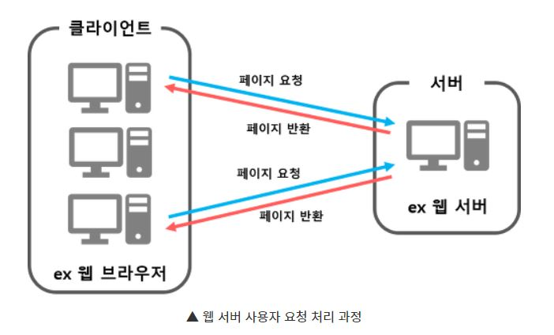
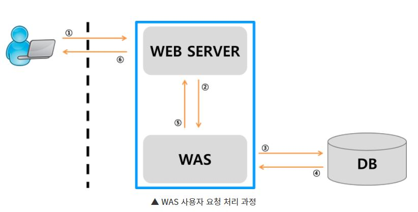

# Web Server vs WAS
- Web Server란?
- Web Server의 기능
- WAS 란?
- WAS의 기능
- Web Server 와 WAS의 차이점
- Web Server와 WAS의 구성에 따른 분류

## You can answer
- Web Server가 무엇인가?
- WAS가 무엇인가?
- Web Server와 WAS의 차이점을 설명해보아라.
-----------------------
## Web Server 란?
- Web Server의 개념
  1) 하드웨어
  - Web 서버가 설치되어 있는 컴퓨터
  2) 소프트웨어
  - 웹 브라우저 클라이언트로부터 HTTP 요청을 받아 정적인 컨텐츠(.html, .jpeg, .css등)를 제공하는 컴퓨터 프로그램

 

 

## Web Server의 기능
- HTTP 프로토콜을 기반으로 하여 클라이언트(웹 브라우저 또는 웹 크롤러)의 요청을 서비스 하는 기능을 담당한다. 

- 기능 1)
  - 정적인 컨텐츠 제공
  - WAS를 거치지 않고 바로 자원을 제공한다. 

- 기능 2)
  - 동적인 컨텐츠 제공을 위한 요청 전달
  - 클라이언트의 요청을 WAS에 보내고, WAS가 처리한 결과를 클라이언트에게 전달(응답)한다.
  - 클라이언트는 일반적으로 웹 브라우저를 의미한다. 

- Web Server의 예 
Ex) Apache Server, Nginx, IIS(Windows 전용 Web서버) 등

 

## WAS(Web Application Server)란?
- DB 조회나 다양한 로직 처리를 요구하는 동적인 컨텐츠를 제공하기 위해 만들어진 Application Server
- HTTP를 통해 컴퓨터나 장치에 애플리케이션을 수행해주는 미들웨어(소프트웨어 엔진)이다.
- 웹 컨테이너(Web Container) 혹은 서블릿 컨테이너(Servlet Container)라고도 불린다. 
Container란 JSP, Servlet을 실행시킬 수 있는 소프트웨어를 말한다. 
즉, WAS는 JSP, Servlet 구동 환경을 제공한다. 

 

 

## WAS의 기능
- WAS = Web Server + Web Container
- Web Server 기능들을 구조적으로 분리하여 처리하고자하는 목적으로 제시되었다. 
분산 트랜잭션, 보안, 메시징, 쓰레드 처리 등의 기능을 처리하는 분산 환경에서 사용된다. 주로 DB 서버와 같이 수행된다.
- 현재는 WAS가 가지고 있는 Web Server도 정적인 컨텐츠를 처리하는 데 있어서 성능상 큰 차이가 없다. 
- 프로그램 실행 환경과 DB 접속 기능을 제공한다.
- 여러 개의 트랜잭션들을 관리하는 기능이 있다.
- 업무를 처리하는 비즈니스 로직을 수행한다.
- WAS의 예 >
Ex) Tomcat, JBoss, Jeus, Web Sphere 등

 

## Web Server 와 WAS의 차이점
- Web Server는 정적인 데이터를 처리하는 서버이다. 이미지나 단순 html 파일과 같은 리소스를 제공하는 서버를 Web Server를 통하면 WAS를 이용하는 것 보다 빠르고 안정적이다.
WAS는 동적인 데이터를 처리하는 서버이다. DB와 연결되어 데이터를 주고 받거나 프로그램으로 데이터 조작이 필요한 경우에는 WAS를 활용해야 한다. 
우리가 만드는 웹페이지는 정적 컨텐츠와 동적 컨텐츠를 함께 노출하게 된다. WAS가 정적 데이터를 처리하게 되면, 동적 컨텐츠의 처리가 지연이 될 것이고 이로 인한 페이지 노출시간이 늘어나게 된다. 
WAS는 동적 처리에 최적화 되어 있는 서비스이기 때문에 처리 속도를 위해, 정적처리는 Web Server에서 처리를 하고, 동적 컨텐츠는 WAS에서 처리하게 된다.

 

## Web Server와 WAS의 구성에 따른 분류
- WAS와 Web Server를 분리하지 않는 경우
모든 컨텐츠를 한곳에 집중시켜 웹서버와 WAS의 역할을 동시에 수행.

- WAS와 Web Server를 분리한 경우
Web Server와 WAS의 기능적 분류를 통해 효과적인 분산을 유도. 정적인 데이터는 Web Server에서 처리, 동적인 데이터는 WAS가 처리

- WAS 여러개와 Web Server를 분리한 경우
WAS단을 프리젠테이션 로직과 비즈니스 로직으로 구분하여 구성. 특정 logic의 부하에 따라 적절한 대응을 할 수 있지만 설계단계 유지보수 단계가 복잡해 질 수가 있다. 

- WAS와 Web Server를 분리하는 이유
  1) 기능을 분리하여 서버의 부하 방지
  2) 물리적으로 분리하여 보안 강화
  3) 여러대의 WAS를 연결 가능
  4) 여러 Web Application을 서비스 가능 (Java 서버, C# 서버, php 서버 등 하나의 웹 서비스를 통해 서비스 가능) 

 

## Reference
- https://gmlwjd9405.github.io/2018/10/27/webserver-vs-was.html
- https://helloworld-88.tistory.com/71