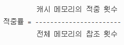

# Cache Memory

## You Can Answer
- 캐시 메모리란 무엇인가요?
- 캐시 메모리의 구성은 어떻게 되어있나요?
- 캐시 메모리의 동작은 어떻게 되나요?

## Cache Memory란?
**캐시 메모리(cache memory)** 는 CPU와 메모리의 속도 차이로 인한 병목 현상을 완화하기 위해 사용한다. 캐시메모리는 메모리와 CPU 사이에 위치해 있으며, 메모리 계층 구조에서 레지스터 다음으로 상위에 위치한다.

## 적중과 실패
캐시메모리가 있는 컴퓨터 시스템은 CPU가 메모리에 접근하기 전 먼저 캐시 메모리에서 원하는 데이터의 존재 여부를 확인한다. 이때 필요한 데이터가 있는 경우를 **적중(hit)**, 없는 경우를 **실패(miss)** 라고 한다.

이 때 요청한 데이터를 캐시메모리에서 찾을 확률을 **적중률(hit ratio)** 이라고 한다.
캐시 메모리의 성능은 적중률에 의해 결정된다.

실패율은 반대로 캐시 메모리의 실패 횟수를 전체 메모리 참조 횟수로 나눈 값이며, (1 - 적중률)로 구할 수 있다.

보통 CPU는 데이터를 가져오기 위해 캐시 메모리 > 메모리 > 보조기억장치 순으로 접근한다.

- **캐시 적중일 때** : 캐시 메모리의 데이터를 CPU 레지스터에 복사한다.
- **캐시 실패/메모리 적중일 때** : 메모리의 데이터를 캐시 메모리에 복사하고, 캐시 메모리의 복제된 내용을 CPU 레지스터에 복사한다.
- **캐시, 메모리 실패일 때** : 보조 기억장치에서 필요한 데이터를 메모리에 복사한다. 메모리에 복제된 내용을 캐시 메모리에 복제한다. 캐시 메모리의 복제된 데이터를 CPU 레지스터에 복제한다.

## 지역성

**지역성**은 짧은 시간 동안 제한된 주소 공간의 일부만 참조되는 경향을 말한다.

- 시간적 지역성(temporal locality) : CPU가 한 번 참조한 데이터는 다시 참조할 가능성이 높다.
- 공간적 지역성(spatial locality) : CPU가 참조한 데이터와 인접한 데이터 역시 참조될 가능성이 높다.
- 순차적 지역성(sequential locality) : 분기가 발생하지 않는 한 명령어는 메모리에 저장된 순서대로 인출/실행된다.

지역성은 어디까지나 경향에 대한 것이므로 항상 캐시의 높은 적중률을 보장해주지는 않는다.

## 캐시 메모리의 기본 구성과 동작

CPU는 데이터를 요청할 때마다 캐시 메모리에서 해당 데이터의 존재 여부를 확인한다.
따라서 캐시 메모리는 요청받은 데이터를 탐색하는 기능이 필요하다.
캐시 메모리는 데이터를 관리하기 위해 **데이터 메모리**와 **태그 메모리**를 사용한다.

- 블록 : 데이터의 기본 단위인 워드의 집합
- 데이터 메모리 : 메모리의 데이터들이 저장된 블록으로 구성되어 있다.
- 태그 메모리 : 데이터 메모리의 블록을 탐색할 정보를 포함한다. 태그 메모리의 엔트리는 데이터 메모리 블록과 쌍을 이루면서 태그, 유효 비트, 갱신 비트를 포함한다. 또한 CPU 주소와 태그를 비교하는 비교기를 가지고 있다.
  - 태그(tag) : CPU가 요청한 데이터를 탐색하는데 사용할 주소의 일부. 캐시 블록 주소에서 인덱스로 사용되지 않는 부분이다.
  - 유효 비트(valid bit) : 캐시 블록이 유효한 데이터인지 나타낸다.
  - 갱신 비트(dirty bit) : 캐시로 블록을 가져온 후 CPU가 블록을 수정했는지 나타낸다.

### 기본적인 동작의 흐름

- CPU가 캐시에 주소 전송 > 태그 메모리 탐색 > 일치하는 태그 발견 (hit) > 블록 상태 갱신(필요할 경우) >데이터 메모리에서 블록 추출 > 요청받은 데이터 선택 > 캐시가 CPU에 데이터 전송
 

- CPU가 캐시에 주소 전송 > 태그 메모리 탐색 > 일치하는 태그 없음(miss) > 주소를 메모리로 전송해 대응하는 블록을 캐시에 저장 > 요청받은 데이터 선택 > 캐시가 CPU에 데이터 전송

## Reference
- [캐시 메모리의 개요 정리](https://zion830.tistory.com/46)
