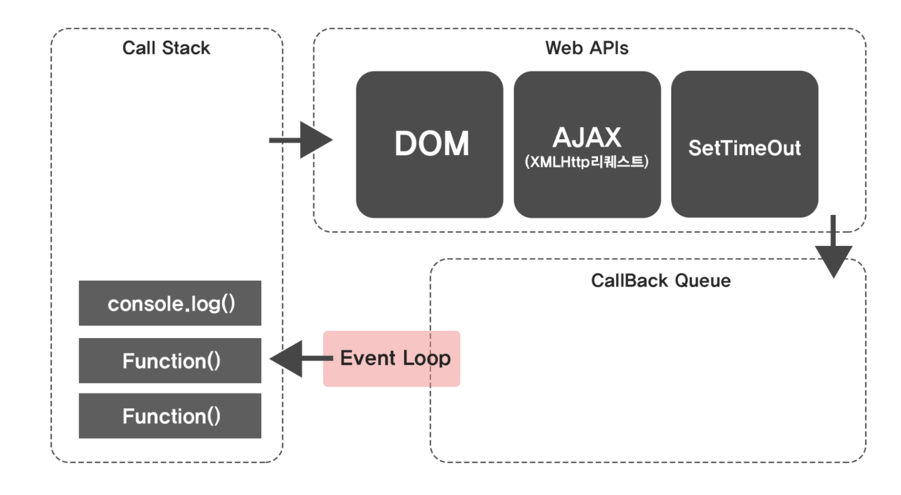

# Javascript 작동 원리
- 자바스크립트 엔진
  - 엔진 정의
  - 엔진 종류

<br/>

- v8 엔진 동작 방식
  - Call stack
  - Web APIs
  - Callback Queue
  - Event Loops

## You can answer
- JS 엔진이 무엇인지 알 수 있다.
- 대표적인 v8엔지의 동작방식을 익힘으로써 JS의 task 관리를 이해할 수 있다.
  
<br/>

### 자바스크립트 엔진
---
### 정의
> Javascript 코드를 실행하는 프로그램 혹은 인터프리터라고 정의함.

### 종류
> v8: 구글 크롬에서 사용되는 엔진, C++로 만들어짐.   
> JavaScriptCore: 애플에서 개발한 사파리용 엔진임.   
> SpiderMonkey: 최초의 자바스크립트 엔진으로 모질라 파이어폭스를 지원함.

<br/>

### v8 엔진 동작 방식
---
### Call stack   
> 현재 실행중인 서브루틴(함수)에 대한 정보들을 담아두는 스택구조의 메모리 영역

- 예시
    ```Javascript
    const function2 = (x,y) =>{
        return console.log(x+y)
    }

    const function1 = (a,b)=>{
        return function2(a,b)
    } 

    function function1(1,2)

    ```

    

    위 그림처럼 순서대로 쌓인 스택은 위에서 부터 처리가 되며 하나씩 삭제해 나간다.(LIFO)

### Web APIs
> 브라우저에서 제공하는 API이다.     
> Call stack에서 비동기 함수(DOM, AJAX, SetTmeout 등)를 호출하면 Web APIs가 호출된다.

- 예시
    
    ```javascript
    SetTimeout(Function(){}, 5000)
    ```
    위 비동기 함수가 있다면, Web APIs에서 5초짜리 타이머가 생성된다.   
    5초 이후, Web APIs는 이 Run함수를 Callback Queue으로 이동시킨다.

### Callback Queue
> Web API 에서 보내진 비동기 처리가 모이는 곳으로 콜 스택과는 다르게 선입선출(FIFO) 되는 특징을 가진다.   
> 여기 모인 비동기함수는 이벤트 루프의 감시하에 놓이게 된다.

### Event Loop
> Call stack과 CallBack Queue를 감시한다.
> Call stack이 비게되면, Queue에 쌓인 비동기 함수를 Call stack으로 이동시킴.
> (이 과정을 'Tick'이라고도 불림)

### 참고
> Javascript는 싱글 스레드 (한 번에 한 가지 일만 처리)임


<br/>

# References
- [더 많은 엔진 종류](https://edu.goorm.io/learn/lecture/557/%ED%95%9C-%EB%88%88%EC%97%90-%EB%81%9D%EB%82%B4%EB%8A%94-node-js/lesson/174354/%EC%9E%90%EB%B0%94%EC%8A%A4%ED%81%AC%EB%A6%BD%ED%8A%B8-%EC%97%94%EC%A7%84%EC%9D%B4%EB%9E%80)