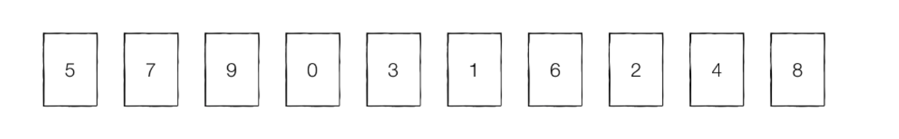
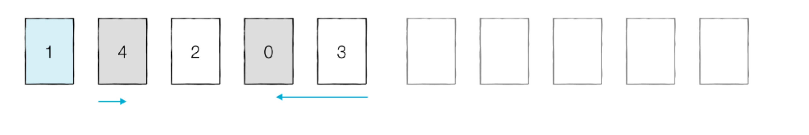

#  What is Quick Sort?
- 정의
- 특징 및 장단점
- 예시 및 구현

## You can answer
---
- 퀵정렬이 무엇인가요?
- 퀵정력의 특징은 무엇인가요?
- 퀵정렬의 장단점은 무엇인가요?
- 퀵정렬을 어떻게 구현하나요?

## 퀵 정렬이란?
  ---
  - 기준(pivot)을 설정한 다음 큰 수와 작은 수를 교환하고 리스트를 반으로 나누는 방식으로 동작한다.
  
  ## 특징 및 장단점
  - 퀵 정렬을 수행하기 전에는 pivot을 어떻게 설정할 것인지 미리 명시해야 한다.
  - 리스트를 분할하는 방법 중 가장 대표적인 방법은 호어 분할 방식(리스트에서 첫번째 데이터를 pivot으로 설정하는 방법)이다.
  - 퀵 정렬의 평균 시간 복잡도는 O(NlogN)이지만, 최악의 경우 O(N^2)이다.
  - 퀵 정렬은 데이터가 무작위로 입력되는 경우 빠르게 동작할 확률이 높다.(장점)
  - 이미 데이터가 정렬되어 있는 경우에는 매우 느리게 동작한다.(단점) 
  
  ## 예시
  ---
    1. 리스트에서 첫 번째 데이터를 pivot으로 정한다.
    2. 왼쪽에서부터 pivot보다 큰 데이터를 찾는다.
    3. 오른쪽에서부터 pivot보다 작은 데이터를 찾는다.
    4. 2와 3의 데이터를 교환한다.
    5. 2와 3의 인덱스가 엇갈렸을 경우, 작은 데이터와 pivot값을 교환한다.
   

  ### A파트
  
- Step1
    1. pivot: 5
    2. left: 7
    3. right: 4
    4. 2번과 3번의  데이터 교환
   
    
     #### Step1 결과
        5 4 9 0 3 1 6 2 7 8
- Step2
    1. pivot: 5
    2. left: 9
    3. right: 2
    4. 2번과 3번의  데이터 교환
    
     #### Step2 결과
        5 4 2 0 3 1 6 9 7 8
    
    - Step3(분할 완료)
    1. pivot: 5
    2. left: 6
    3. right: 1
    4. 2번과 3번이 엇갈렸으므로 작은데이터(right)와 pivot의 위치를 변경한다.
    
     #### Step3 결과
        1 4 2 0 3 5 6 9 7 8
        
        - '5'의 왼쪽에 있는 데이터는 모두 '5'보다 작다.
        - '5'의 오른쪽에 있는 데이터는 모두 '5'보다 크다.
     - pivot의 왼쪽에는 pivot보다 작은 값이, 오른쪽은 큰 값이 오도록 하는 작업을 분할(divide) 혹은 파티션(partition)이라고 한다.
    
### B파트
- 5를 기준으로 왼쪽에 있는 데이터를 A파트와 동일한 방법으로 정렬한다.
  

### C파트
- 5를 기준으로 오른쪽에 있는 데이터를 A파트와 동일한 방법으로 정렬한다.
  

## 결과
    0 1 2 3 4 5 6 7 8 9

## 코드(JS)
